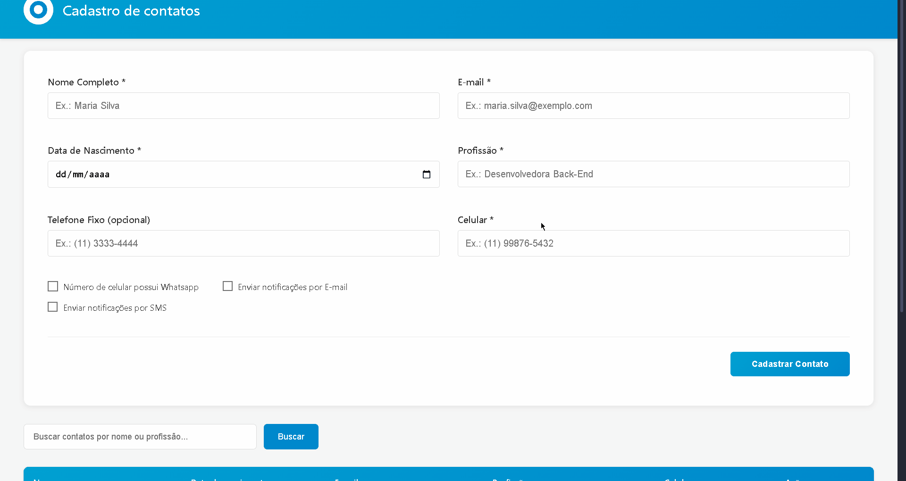

# 📇 Frontend – Gerenciamento de Contatos

Aplicação frontend desenvolvida em Angular para consumo da API de gerenciamento de contatos. O projeto foi construído com foco em organização, clareza arquitetural, boas práticas de frontend moderno e fidelidade ao wireframe fornecido no teste técnico.

## 📌 Visão Geral do Projeto

Este frontend faz parte de um teste técnico fullstack, tendo como objetivo demonstrar:

- Capacidade de estruturar um projeto Angular profissional
- Consumo correto de APIs REST
- Separação de responsabilidades
- Organização de código escalável
- Fidelidade a requisitos visuais (wireframe)
- Boas práticas de integração frontend ↔ backend

## 🎥 Demonstração da Aplicação

Abaixo está uma demonstração do funcionamento da aplicação:



A demonstração apresenta:
- Listagem de contatos
- Criação de novo contato
- Edição de contato existente
- Remoção de contato

### Funcionalidades implementadas

- Listagem de contatos
- Busca por nome e profissão
- Paginação de resultados
- Cadastro de novo contato
- Edição de contato existente
- Remoção de contato
- Tratamento de loading e erro
- Integração completa com API REST em PHP

## 🧱 Arquitetura e Estrutura de Pastas

O projeto utiliza Angular com Standalone Components, evitando o uso de módulos tradicionais e priorizando uma arquitetura mais moderna e enxuta.

```text
contatos-frontend/
│
├── public/
│   ├── favicon.ico
│   ├── brush.svg
│   ├── trash.svg
│   └── logo_rodape_alphacode.png
│
├── src/
│   ├── app/
│   │   ├── components/
│   │   │   └── home/
│   │   │       ├── home.html
│   │   │       ├── home.css
│   │   │       ├── home.ts
│   │   │       └── home.spec.ts
│   │   │
│   │   ├── services/
│   │   │   ├── api/
│   │   │   │   └── api.config.ts
│   │   │   │
│   │   │   ├── models/
│   │   │   │   └── contato.model.ts
│   │   │   │
│   │   │   ├── contatos.service.ts
│   │   │   ├── types.ts
│   │   │   └── index.ts
│   │   │
│   │   └── index.ts
│   │
│   ├── index.html
│   ├── main.ts
│   └── styles.css
│
├── angular.json
├── package.json
├── package-lock.json
└── README.md
```

### 📂 Organização por Responsabilidade
#### 🧩 Components
- Responsáveis pela interface visual
- Contêm HTML, CSS e lógica de interação
- Exemplo: tela principal (HomeComponent)

### 🔧 Services
- Responsáveis por comunicação com a API
- Centralizam requisições HTTP
- Tratam regras de consumo de dados

### 📦 Models
- Definem a estrutura dos dados
- Facilitam tipagem e manutenção do código

### ⚙️ API Config
- Centraliza a URL base do backend
- Facilita troca de ambiente (local / produção)

## 🛠️ Stack Utilizada

- Angular
- TypeScript
- HTML5
- CSS
- RxJS
- Angular CLI
- Node.js / NPM
- Consumo de API REST

## ⚙️ Como Rodar o Projeto Localmente

### Pré-requisitos
- Node.js (versão LTS)
- Angular CLI
- Backend rodando localmente. [Clique aqui](https://github.com/gioxavier7/contatos-backend) para acessar o repositório do servidor backend

### 1️⃣ Clonar o repositório

```bash
git clone https://github.com/gioxavier7/contatos-frontend.git
cd contatos-frontend
```

## 2️⃣ Instalar dependências
```bash
npm install
```

## 3️⃣ Configurar URL da API
**Arquivo:** `src/app/services/api/api.config.ts`

Exemplo
```typescript
export const API_CONFIG = {
  baseUrl: 'http://localhost:8000'
};
```
Ajuste a URL conforme o ambiente do backend.

## 4️⃣ Iniciar a aplicação
```bash
ng serve
```
A aplicação estará disponível em: http://localhost:4200

---

## 🔗 Integração com o Backend

A aplicação consome a API REST desenvolvida em PHP, com endpoints como:
- GET /contatos
- GET /contatos/{id}
- POST /contatos
- PUT /contatos/{id}
- DELETE /contatos/{id}

A comunicação é feita via HttpClient, utilizando RxJS Observables.

## 📐 Wireframe

A interface foi desenvolvida com base no wireframe fornecido no teste técnico, respeitando:
- Estrutura visual
- Campos obrigatórios
- Fluxo de cadastro e edição
- Ações de edição e exclusão

## 📌 Boas Práticas Adotadas
- Separação clara de responsabilidades
- Código tipado com TypeScript
- Serviços reutilizáveis
- Estrutura escalável
- Organização semântica de pastas
- Integração limpa com API REST
- Projeto versionado com Git

## 👩‍💻 Desenvolvedora
**Giovanna Soares Xavier**  
Desenvolvedora  Full Stack

Projeto desenvolvido para fins de avaliação técnica.

---

## 📝 Observações Finais
Este frontend foi desenvolvido com foco em clareza, organização e boas práticas, priorizando um código fácil de entender, manter e evoluir. A arquitetura adotada permite fácil expansão de funcionalidades futuras e integração com novos módulos.
